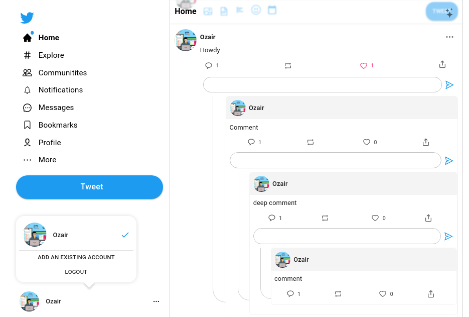

### Twitter clone made in React using Material UI and Firebase


See [demo here](https://ozair-dev.github.io/twitter)

## Technologies Used
  - React
  - React-redux
  - Material-UI
  - React-hook-form
  - React-router
---

## Features
  - Twitter-like UI
  - Login/signup with firebase
  - Google Login
  - User can make posts
  - Multiple level (nested) comments
---

## Previews

### Welcome Page


### Posts


### Multiple level (Nested) comments


## Getting started

Clone this repository and install its dependencies:

```bash
git clone https://github.com/ozair-dev/twitter.git
cd twitter
npm install
```

`npm run dev` launches a server with hot reloading. Navigate to [localhost:3000](http://localhost:3000).

`npm run build` builds the application to `dist`, generating two bundles for differential serving.

`npm run preview` launches a server over the previously build.


## License

[MIT](LICENSE).